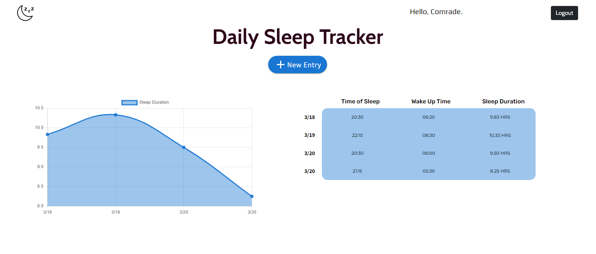

## A MERN Stack Based Web Application - A Daily Sleep Tracker

## Welcome! 👋

Irregular sleeping patterns are a common problem. This web app will fulfill the user's needs in tracking their sleeping patterns, including duration and timings.

## Installation and Setup.

For fellow Developer who would like to check the code out and make use of it, use the following Instructions:

- git clone my code files and open it up.
- Download and Install [node](https://nodejs.org/en/) and [mongoDB](https://www.mongodb.com/) if you haven't done that.
- Open up command prompt or Terminal and cd into the Directory😉.
- Run `npm install` on the command prompt to install all nodejs dependencies used in this project.
- Create `.env` file and allot `SECRET`, `NODE_ENV`, `PORT` and `MONGO_URI` to a value.
- Afterward, run `npm run dev` in the terminal to start both the frontend and backend simultaneously, open ur browser and use `localhost:3000` in the search bar.

> **Note:** To do this, you need quite an understanding on Node,React and JavaScript.

## Usage.

All you've got to do as a User is:

- Login with your email address and password used to register.
- Register instead if you don't have an account on **`Sleep Tracker`**.
- Afterwards, You can login each day and make your entry to track your sleep patterns.
  > **Note:** For now its still under development, it's not set for production

## Technology used.

- Bootstrap
- Jquery
- React
- Expressjs
- MongoDB
- Passportjs
- Nodejs

## Credit

- I got the project idea from [codementor.io](https://codementor.io/).

Find it useful?. 😉

**Have fun** 🚀
